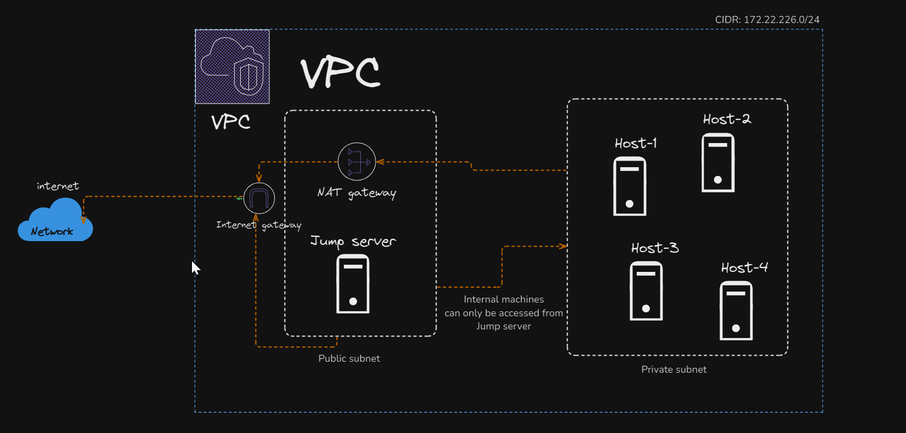

# 🔐 Terraform AWS Infrastructure: VPC with Jump Server & Private Hosts

A fully functional and modular Terraform project to provision a secure AWS infrastructure that includes:

- VPC with public & private subnets  
- Internet & NAT Gateways  
- EC2 Jump Server (Bastion)  
- Internal private EC2 hosts  
- SSH Key pair generation  
- Basic routing and security groups  

---

## 📌 Architecture Overview


> CIDR: `172.22.226.0/24`  
> Internal machines are only accessible via the Jump Server.

---

## 🚀 Getting Started

### Prerequisites

- Terraform >= v1.0
- AWS CLI configured (`aws configure`)
- AWS IAM credentials with sufficient permissions

---

## 🛠️ Usage

```bash
# Navigate to main infrastructure directory
cd Infrastructure/main

# Initialize Terraform
terraform init

# Review changes
terraform plan

# Apply infrastructure
terraform apply
